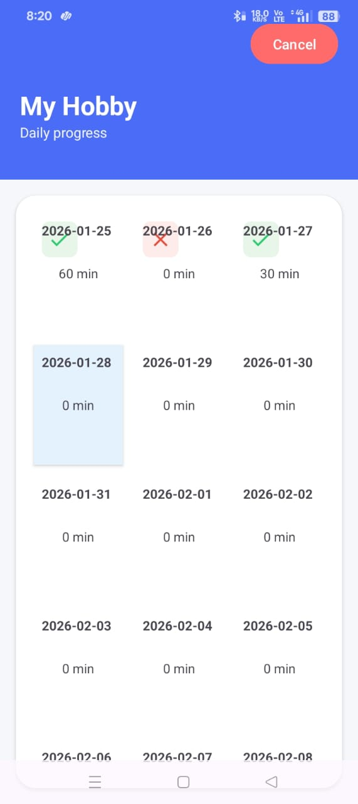
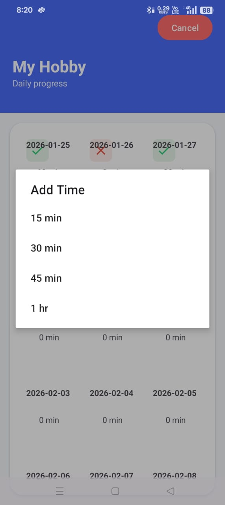
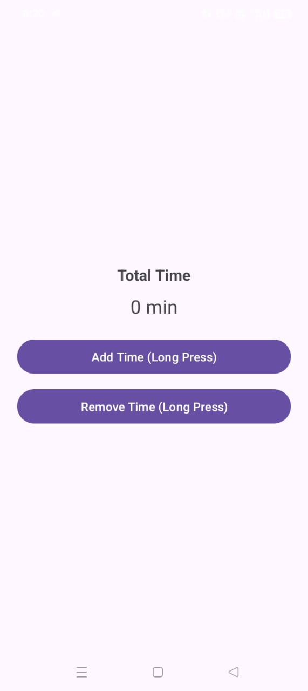

<h1 align="center">🎯 Hobify</h1>

  <b>Daily Hobby Time Tracking Android Application</b> 
  Build consistency by tracking time spent on what you love.

  
  
  

<h2>📖 About the App</h2>

Hobbies play an important role in personal growth, creativity, and mental well-being.
Activities such as drawing, reading, music, fitness, writing, or coding help reduce
stress and improve focus when practiced regularly.

Despite knowing their importance, many people struggle to follow their hobbies
consistently due to busy schedules or lack of proper tracking.
Without knowing how much time is actually spent, it becomes difficult to stay disciplined.

<b>Hobify</b> was created as a simple solution to this problem.
The app helps users track how much time they spend on their hobbies each day
and encourages them to follow their hobbies regularly.

This project focuses on simplicity and ease of use, making it suitable for students,
artists, creators, and anyone who wants to build a strong and consistent hobby habit.

<h2>⚙️ How the App Works</h2>

When the user opens the app for the first time, they are prompted to
<b>enter a hobby name</b> along with a <b>starting date</b> and an <b>end date</b>.
This allows the user to define the duration for which they want to follow
and track a particular hobby.

Once the hobby and date range are set, the app creates a structured timeline
between the selected start and end dates.
Each day in this timeline represents a chance to work on the hobby
and record the time spent.

The user can start tracking time when they begin working on the hobby
and stop it once the activity is completed.
The app automatically calculates and stores the total time spent
on the hobby for that day.

All tracked data is stored day-wise, allowing users to easily view
how much time they have dedicated to their hobby throughout the selected period.
This helps users analyze consistency and progress clearly.

By setting a clear time-bound goal and tracking daily effort,
Hobify motivates users to stay disciplined, focused, and committed
to following their hobbies regularly.

<h2>✨ Key Features</h2>

<ul>
  <li>Daily hobby time tracking</li>
  <li>Custom hobby duration using start and end dates</li>
  <li>Encourages consistency and habit building</li>
  <li>Clean and minimal user interface</li>
  <li>Beginner-friendly and easy to use</li>
</ul>

<h2 align="center">📸 App Preview</h2>

  
  
  

  <i>Hobby setup, time tracking, and daily progress overview</i>

<h2>🛠️ Tech Stack</h2>

<ul>
  <li><b>Language:</b> Kotlin</li>
  <li><b>IDE:</b> Android Studio</li>
  <li><b>UI Design:</b> XML</li>
  <li><b>Platform:</b> Android</li>
</ul>

<h2>🚀 How to Run the Project</h2>

<pre>
git clone https://github.com/shrey-space/Hobify.git
</pre>

<ol>
  <li>Open the project in <b>Android Studio</b></li>
  <li>Allow Gradle to sync completely</li>
  <li>Run the app on an emulator or physical Android device</li>
</ol>

<h2>👨‍💻 Author</h2>

<b>Shrey</b> 
Software & Full-Stack Development Enthusiast 
GitHub: <a href="https://github.com/shrey-space">shrey-space</a>

⭐ If you find this project useful, consider starring the repository.

